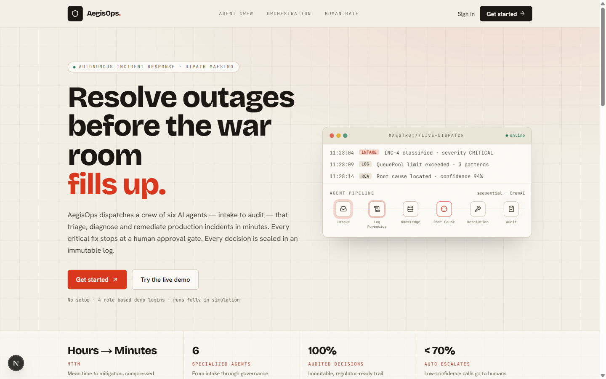
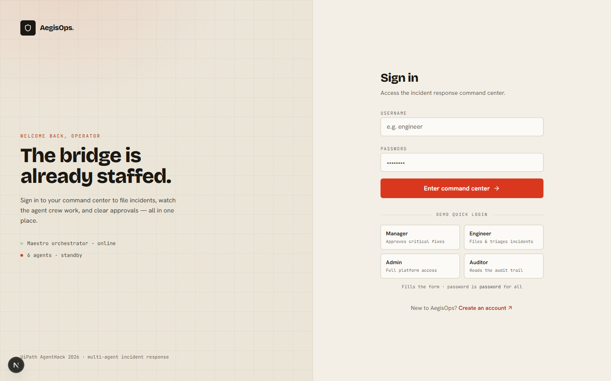
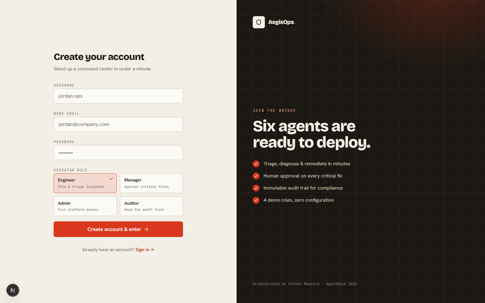
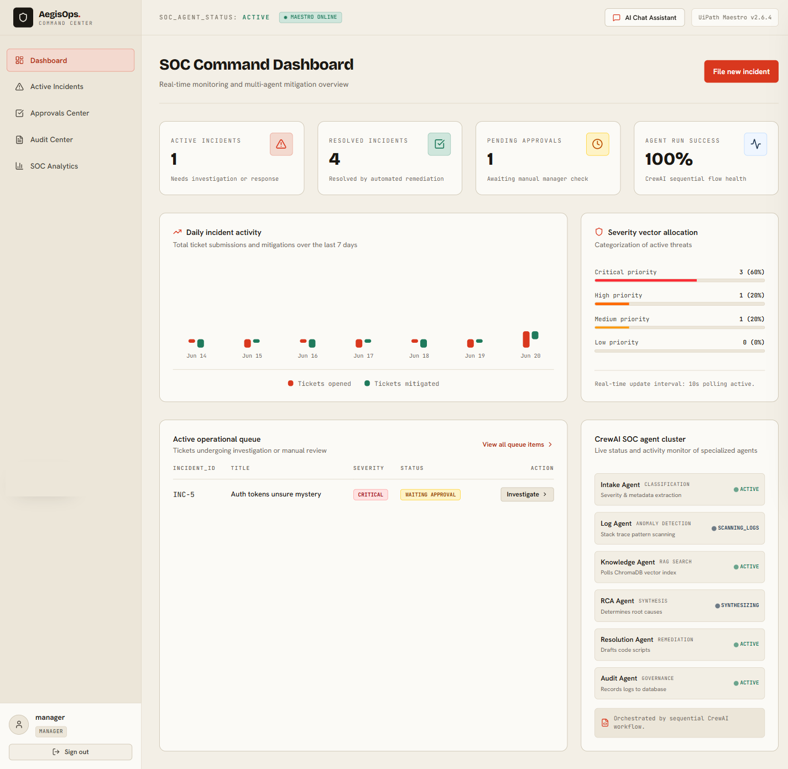
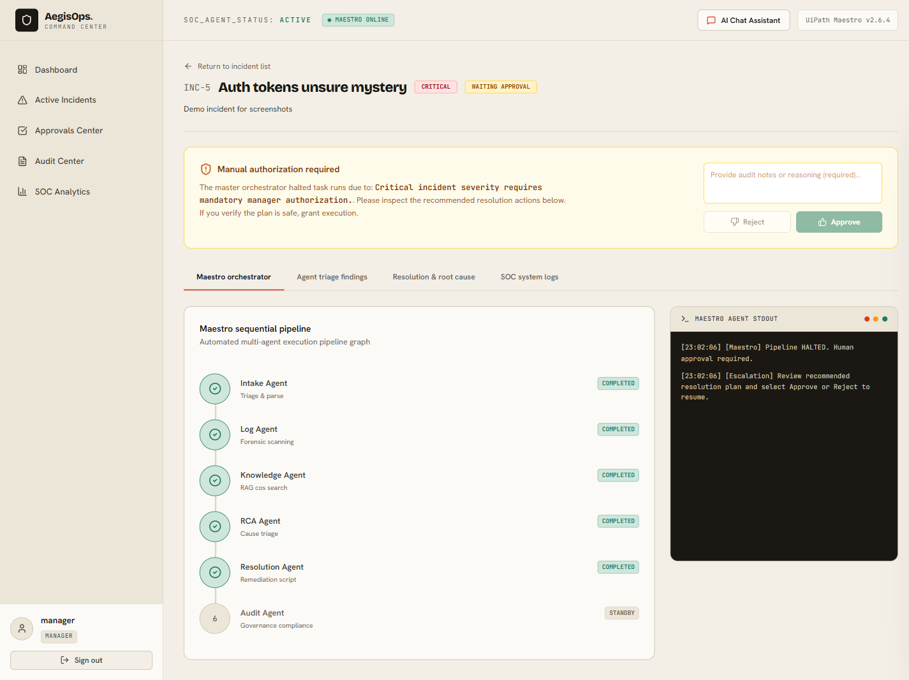
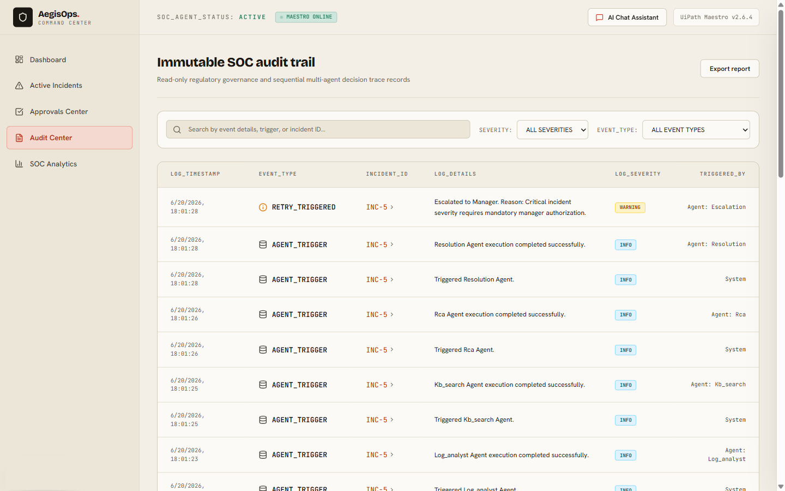
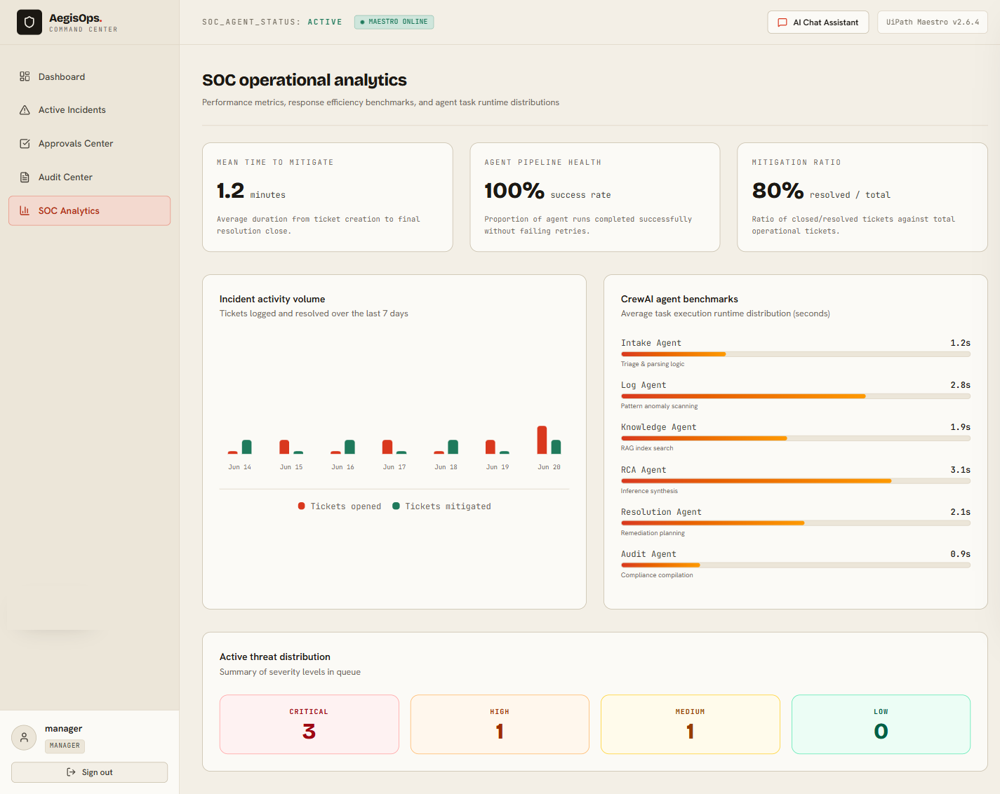

<!-- ━━━━━━━━━━━━━━━━━━━━━━━━━━━━━━━━━━━━━━━━━━━━━━━━━━━━━━━━━━━━━━━━━━━━━━━ -->
<!--   ▙▖ THE AEGISOPS DISPATCH ▗▟   ·   VOL I · NO. 01   ·   AGENTHACK '26  -->
<!-- ━━━━━━━━━━━━━━━━━━━━━━━━━━━━━━━━━━━━━━━━━━━━━━━━━━━━━━━━━━━━━━━━━━━━━━━ -->

<div align="center">

```
        ╔══════════════════════════════════════════════════════════╗
        ║                                                          ║
        ║      A E G I S O P S   A I   ·   D I S P A T C H         ║
        ║                                                          ║
        ║  ─────────────────────────────────────────────────────   ║
        ║      MULTI-AGENT INCIDENT RESPONSE COMMAND CENTER        ║
        ║         Orchestrated by UiPath Maestro · CrewAI          ║
        ║  ─────────────────────────────────────────────────────   ║
        ║                                                          ║
        ╚══════════════════════════════════════════════════════════╝
```

**Resolve outages before the war room fills up.**  
A six-agent crew — intake to audit — that triages, diagnoses, and remediates
production incidents in minutes, with a human approval gate on every critical fix.

[](https://github.com/MaharMuavia/aegisops-ai/actions/workflows/ci.yml)
[](https://github.com/MaharMuavia/aegisops-ai/commits/main)
[](#)
[](https://uipath.com)

[](https://nextjs.org)
[](https://react.dev)
[](https://fastapi.tiangolo.com)
[](https://github.com/crewAIInc/crewAI)
[](https://tailwindcss.com)
[](#sec-simulation)

**[🎬 Watch the Demo](https://youtu.be/Xa3JxiJV158) · [📊 Presentation Deck](https://docs.google.com/presentation/d/1H5sW_55V2HzTdZhr1lUbJ7WXjz7Ewxll/edit?usp=sharing) · [📋 Submission Brief](#submission-brief) · [🚀 Quick Start](#quick-start) · [📖 Full Docs](#sec-running)**

[](https://youtu.be/Xa3JxiJV158)

</div>

---

<a id="submission-brief"></a>

# 📋 Submission Brief — for AgentHack 2026 judges

> The four sections below answer the required submission checklist directly.
> Skip ahead if you'd rather see the live app at [Quick Start](#quick-start).

## Project Description

**AegisOps AI is a multi-agent IT incident-response command center.**

**The problem.** When a production incident lands (auth service spiking 500s,
DB pool exhausted, disk pressure on a storage node), the first 30 minutes are
manual and slow: an engineer triages the ticket, pulls logs, hunts for the
right runbook in scattered docs, forms a hypothesis, drafts a fix, and pages
a manager for sign-off. Information is fragmented across tickets, logs,
emails, and wikis. **Mean Time To Mitigation (MTTM) is dominated by
hand-offs, not by the fix itself.**

**The solution.** AegisOps dispatches a crew of six specialised AI agents
that work a sequential master workflow — **Intake → Log Forensics →
Knowledge (RAG) → Root Cause → Resolution → Audit** — with two safety
mechanisms: (1) per-agent retries on transient failure, and (2) a
human-in-the-loop approval gate that halts the pipeline whenever severity
is critical or RCA confidence drops below 70%. Every agent decision, retry,
and human override is sealed into an immutable audit trail. The platform
ships with a SOC-style operator UI (dashboard, incident detail, approvals
queue, audit center, analytics) so an on-call manager can watch agents
work, approve fixes, and export a compliance-ready case file.

**Outcome.** What used to take a war-room hour collapses to a few minutes
of agent runtime + one human click — and produces a regulator-grade paper
trail by default.

## UiPath Components

Honest accounting of what is present in this submission:

| UiPath component | Used in AegisOps? | Where / how |
| :--- | :--- | :--- |
| **Coded Agents** | ✅ **Yes** | Six CrewAI agents (role / goal / backstory + delegation) defined in Python at [`backend/app/services/agents.py`](backend/app/services/agents.py). |
| **UiPath Maestro (sequential master workflow)** | 🟡 **Pattern, implemented in code** | The Maestro sequential-orchestration pattern — sequential agent dispatch, per-agent retry loops, and human-in-the-loop escalation gates — is implemented in custom Python at [`backend/app/services/uipath_maestro.py`](backend/app/services/uipath_maestro.py). A separate end-to-end demo script at [`uipath/uipath_maestro_flow.py`](uipath/uipath_maestro_flow.py) acts as a headless Maestro client that drives the full workflow via the API. **This solution does not call the hosted UiPath Maestro product**; the orchestration pattern is reproduced in code so the demo runs anywhere with zero external dependencies. |
| **API Workflows** | ✅ **Yes** | FastAPI surfaces 6 routers (`auth · incidents · approvals · audit · metrics · agents`) under `/api/*`; the orchestrator calls these endpoints to advance state. Full Swagger UI at `/docs`. See [`backend/app/api/endpoints/`](backend/app/api/endpoints/). |
| **Human-in-the-loop approval gate** (Action App pattern) | ✅ **Yes, implemented in code** | The orchestrator halts on critical severity OR confidence < 70%, creates an `Approval` row, and waits. A manager/admin role actions the request from the Approvals Center UI; the workflow resumes via [`resume_after_approval`](backend/app/services/uipath_maestro.py). UI route: [`frontend/src/app/approvals/page.tsx`](frontend/src/app/approvals/page.tsx). |
| **RAG / Knowledge Base** | ✅ **Yes** | ChromaDB vector store (when enabled) with a SQL keyword fallback over a `documents` table of Standard Operating Procedures. See [`backend/app/services/rag_service.py`](backend/app/services/rag_service.py). |
| **Compliance / report export** | ✅ **Yes** | One-click downloadable incident report from the detail page — full agent trail, root cause, resolution plan, approval decision and audit log. Endpoint: `GET /api/incidents/{id}/report`. |
| Agent Builder (low-code) | ❌ **No** | Not used in this submission. |
| UiPath Studio (RPA) | ❌ **No** | Not used in this submission. |

## Agent Type

**Coded Agents — exclusively.**

All six agents in this solution are **code-defined** (Python + CrewAI). No
low-code / Agent Builder agents are used. Each agent has explicit `role`,
`goal`, and `backstory` definitions and runs inside a sequential CrewAI
process driven by the Maestro orchestrator.

| # | Agent | Role | Goal |
| :- | :--- | :--- | :--- |
| 1 | **Intake Agent** | Triage Specialist | Parse the ticket, classify severity, extract metadata. |
| 2 | **Log Forensics Agent** | Log Analyst | Scan uploaded logs for fatal patterns, build a degradation timeline. |
| 3 | **Knowledge Agent** | SOP Retriever | Vector-search the RAG store for matching runbooks and prior fixes. |
| 4 | **Root Cause Agent** | RCA Synthesiser | Fuse log anomalies with SOPs to locate the failure; emit a confidence score. |
| 5 | **Resolution Agent** | Remediation Author | Draft a step-by-step fix with rollback safe-fails and a risk grade. |
| 6 | **Audit Agent** | Compliance Officer | Seal an immutable record of every decision, retry and override. |

Source of truth for the agent definitions:
[`backend/app/services/agents.py`](backend/app/services/agents.py)

## Setup Instructions

Step-by-step instructions to run the full solution end-to-end for
judging. The platform is designed to run with **zero external API keys** in
default simulation mode.

### Prerequisites

| Tool | Version | Required for |
| :--- | :--- | :--- |
| Python | **3.10 +** (3.12 tested) | Backend |
| Node.js | **20 +** | Frontend |
| Git | any recent | Cloning |
| Docker + Docker Compose | *(optional)* | Full-stack one-command run |

### Path A — Local development (recommended for first run, ~3 minutes)

**1. Clone the repository**

```bash
git clone https://github.com/MaharMuavia/aegisops-ai.git
cd aegisops-ai
```

**2. Start the backend**

```bash
cd backend
python -m venv .venv

# macOS / Linux
source .venv/bin/activate
# Windows (Git Bash / PowerShell)
source .venv/Scripts/activate

pip install -r requirements.txt
python run.py
```

**Expected output:**
```
Initialize AegisOps AI SOC database schema...
Seeding database with default parameters...
Seeding users completed. (Password for all is 'password')
Launching FastAPI Web Server on http://localhost:8001...
INFO:     Application startup complete.
```

✅ **Verify:** open <http://localhost:8001/docs> — you should see the Swagger UI listing the AegisOps API.

**3. Start the frontend** *(new terminal)*

```bash
cd frontend
npm install
npm run dev
```

**Expected output:**
```
   ▲ Next.js 15.5.19 (Turbopack)
   - Local:        http://localhost:3000
 ✓ Ready in ~6s
```

✅ **Verify:** open <http://localhost:3000> — the landing page loads. Click **Sign in** and use the **Manager** quick-login (or any of the seeded accounts below).

**4. Walk the demo flow**

1. Sign in as **manager** (password `password`).
2. Click **File new incident** and submit a ticket with title `Auth service login failures spiking` (the word `auth` triggers a critical-severity demo with 94% confidence).
3. Watch the Maestro pipeline run in the **Maestro orchestrator** tab — six agents execute sequentially, terminal logs stream live.
4. The workflow halts at the human approval gate. Provide a comment and click **Approve** — the workflow resumes and closes the incident.
5. Open **Audit Center** to see the immutable trail; download the case file via **Download report** on the incident page.

**5. (Optional) Run the headless Maestro demo script**

A scripted end-to-end exercise of the workflow (intended as a Maestro-style job runner):

```bash
# Backend must be running. Note: this script uses port 8000;
# override BASE_URL inside the file or run backend with APP_PORT=8000.
python uipath/uipath_maestro_flow.py
```

It authenticates, files a critical incident, polls every agent state, hits the approval gate, approves as manager, and prints the final audit log.

### Path B — Full stack via Docker Compose

Brings up Postgres + Redis + ChromaDB + backend + frontend in one command.

```bash
docker compose up --build
```

Once the containers are healthy:
- Frontend → <http://localhost:3000>
- API docs → <http://localhost:8000/docs> *(Docker uses port 8000; local dev uses 8001 to avoid common port conflicts)*

### Seed accounts (all use password `password`)

| Role | Username | What you can do |
| :--- | :--- | :--- |
| 🛡 Admin | `admin` | Everything |
| 🎯 Manager | `manager` | Approve / reject critical remediations |
| 🔧 Engineer | `engineer` | File incidents, watch agents work |
| 📓 Auditor | `auditor` | Read the audit trail |

### Optional: enable real CrewAI / OpenAI execution

By default `SIMULATION_MODE=true` — the agent pipeline runs **deterministically without any LLM calls** so the demo is reproducible. To run real CrewAI agents instead:

```bash
# in backend/ (or via docker-compose.yml)
export SIMULATION_MODE=false
export OPENAI_API_KEY=sk-...
python run.py
```

On any LLM error the platform silently falls back to simulation so the demo never dies on stage.

### Troubleshooting

| Symptom | Fix |
| :--- | :--- |
| `WinError 10013` / port 8000 busy | Backend defaults to **8001** locally. Override with `APP_PORT=8001 python run.py` (already the default in `run.py`). |
| `bcrypt password cannot be longer than 72 bytes` | `requirements.txt` pins `bcrypt==4.0.1` (passlib 1.7 is incompatible with bcrypt 4.1+). Re-install: `pip install -r requirements.txt --force-reinstall`. |
| `email-validator is not installed` | Re-install requirements. `email-validator>=2.0.0` is pinned. |
| Seeded users missing / want fresh state | Delete `backend/aegisops.db` and restart `python run.py`. |

---

<a id="quick-start"></a>

## ⚡ Quick Start

**Get running in 3 minutes:**

```bash
# Backend
cd backend
python -m venv .venv && source .venv/Scripts/activate   # Windows
pip install -r requirements.txt
python run.py    # http://localhost:8001

# Frontend (new terminal)
cd frontend
npm install
npm run dev       # http://localhost:3000
```

**One-command full stack:**
```bash
docker compose up --build
```

**Demo logins** (password: `password`):
- `admin` — Full access
- `manager` — Approve/reject incidents  
- `engineer` — File incidents, watch agents
- `auditor` — Read-only audit trail

---

## 📑 Navigation

| Section | Purpose |
|---------|---------|
| [📋 Submission Brief](#submission-brief) | Project description · UiPath components · Agent type · Setup *(judges' checklist)* |
| [Problem & Solution](#sec-wire) | What AegisOps solves *(extended)* |
| [Architecture](#sec-orchestration) | System design |
| [Simulation Mode](#sec-simulation) | How the demo works |
| [Repo Structure](#sec-repomap) | File layout |

---

<a id="sec-wire"></a>

## ┃ THE WIRE  ·  *what this is*

> **AegisOps AI** is a SOC command center for the modern incident bridge.
> Six specialized AI agents — **Intake, Log Forensics, Knowledge, RCA, Resolution, Audit** —
> work a sequential UiPath Maestro workflow with human-in-the-loop manager gates.
> When a critical incident lands, the crew handles the boring 80%, calls a human
> for the dangerous 20%, and seals everything in an immutable audit trail.

The whole platform runs **out of the box with zero API keys** in deterministic
simulation mode — built so judges, recruiters, and you can clone it,
`docker compose up`, and watch agents work in under three minutes.

---

## ┃ EXHIBIT A  ·  *the landing*



A custom-typed editorial layout — **Inter Tight** for heavy, tight display
headings, **Inter** for body, **JetBrains Mono** for telemetry — sitting on
warm bone paper with a vermilion accent.

---

<a id="sec-orchestration"></a>

## ┃ THE ORCHESTRATION  ·  *how a ticket moves*

```
        ┌───────────┐                                ┌─────────────────┐
        │   USER    │                                │   AUDIT LOG     │
        │  files an │                                │  immutable.     │
        │  incident │                                │  forever-read.  │
        └─────┬─────┘                                └────────▲────────┘
              │                                               │
              ▼                                               │
   ╔══════════════════════════════════════════════════════════════════════╗
   ║                                                                      ║
   ║       UiPath Maestro · sequential master workflow                    ║
   ║                                                                      ║
   ║   ① INTAKE  →  ② LOG     →  ③ KB       →  ④ ROOT     →  ⑤ RESOLVE   ║
   ║   triage      forensics    retrieval     cause          plan + risk  ║
   ║                                          (confidence%)               ║
   ║                                                                      ║
   ║      │  retry × up to 3 on transient agent failure                   ║
   ║      └─────────────────────────────────────────────────────┐         ║
   ║                                                            ▼         ║
   ║                       ┌──────────────────────────────────────────┐   ║
   ║                       │  ESCALATION GATE                         │   ║
   ║                       │  ─ severity == critical  → halt          │   ║
   ║                       │  ─ confidence  <  70%    → halt          │   ║
   ║                       └──────────────────┬───────────────────────┘   ║
   ║                                          │                           ║
   ║                          ╭───────────────┴────────────────╮          ║
   ║                          ▼                                ▼          ║
   ║                  ⛔  HUMAN GATE                    AUTO-PROCEED      ║
   ║                  manager approves /                                  ║
   ║                  rejects + comments                                  ║
   ║                          │                                ▼          ║
   ║                          └──────► ⑥ AUDIT ◄──── EXECUTE REMEDIATION  ║
   ║                                   compliance       (scaled pods,     ║
   ║                                   seal             session reapers,  ║
   ║                                                    rollbacks)        ║
   ╚══════════════════════════════════════════════════════════════════════╝
```

**Status lifecycle:**
`open → investigating → waiting_approval → remediating → resolved → closed`

---

## ┃ THE STAFF ROSTER  ·  *demo logins, password is `password`*

| Role        | Username   | Authorised to…                                         |
| :---------- | :--------- | :----------------------------------------------------- |
| 🛡️  Admin   | `admin`    | Everything. Full platform access.                      |
| 🎯  Manager | `manager`  | Approve or reject critical remediation scripts.        |
| 🔧  Engineer| `engineer` | File incidents, watch agents work, trigger runs.       |
| 📓  Auditor | `auditor`  | Read the immutable audit trail.                        |

The login screen has a one-click "Quick Login" widget for each role — no typing.



New operators can sign up with their own credentials and pick a role:



---

## ┃ FROM THE FLOOR  ·  *the command dashboard*

Once authenticated, the dashboard becomes the operator's bridge —
live stats, severity allocation, an active queue, and the **CrewAI agent
cluster** showing which agents are on standby vs. mid-investigation.



---

## ┃ A FILED REPORT  ·  *the incident detail page*

Each ticket gets a four-tab investigation file: the **Maestro orchestrator**
(the pipeline graph + a live agent stdout terminal), **agent findings**,
**resolution & root cause**, and the full **SOC system logs** timeline.

When the workflow hits the escalation gate, the human-in-the-loop amber panel
appears at the top — and only the `manager` and `admin` roles can action it.
Every incident also has a **one-click downloadable report** — a plain-text
export of the full agent trail, root cause, resolution plan, approval
decision, and immutable audit log, ready to hand to compliance.



---

## ┃ THE PAPER TRAIL  ·  *audit center*

Every agent trigger, every retry, every manager decision, every status
transition — sealed into a read-only table with severity badges and per-row
incident links. Filterable, searchable, regulator-ready.

Each incident also has a **"Download report"** button (top-right of the
detail page) that exports the full case file as plain text — description,
root cause, resolution plan, every agent's findings, the approval decision,
and the complete immutable audit trail. Served by
[`GET /api/incidents/{id}/report`](backend/app/api/endpoints/incidents.py).



---

## ┃ THE NUMBERS DESK  ·  *operational analytics*

Mean Time To Mitigate, agent pipeline success rate, mitigation ratio, daily
trend chart, **per-agent runtime benchmarks**, and an active-threat severity
allocation grid.



---

## ┃ TECHNICAL APPENDIX  ·  *manifest*

```
┌────────────────────┬─────────────────────────────────────────────────┐
│ Backend            │  FastAPI · SQLAlchemy · Pydantic · python-jose  │
│                    │  CrewAI · LangChain · ChromaDB (optional)       │
│                    │  SQLite (dev) · PostgreSQL (compose) · bcrypt   │
├────────────────────┼─────────────────────────────────────────────────┤
│ Frontend           │  Next.js 15 (App Router) · React 19 · TS        │
│                    │  Tailwind v4 · TanStack Query · Zustand         │
│                    │  Inter Tight (display) · Inter (body)           │
│                    │  JetBrains Mono · lucide-react                  │
├────────────────────┼─────────────────────────────────────────────────┤
│ Orchestration      │  Simulated UiPath Maestro sequential workflow   │
│                    │  Six CrewAI cooperating agents                  │
│                    │  Background-task dispatch with retry queue      │
├────────────────────┼─────────────────────────────────────────────────┤
│ Auth               │  JWT (python-jose) · bcrypt (pinned 4.0.1)      │
│                    │  Role-based: admin / manager / engineer/auditor │
├────────────────────┼─────────────────────────────────────────────────┤
│ Infrastructure     │  Docker Compose: db · redis · chroma · backend  │
│                    │                  · frontend                     │
└────────────────────┴─────────────────────────────────────────────────┘
```

---

<a id="sec-running"></a>
<a id="sec-simulation"></a>

## ┃ SIMULATION MODE  ·  *the magic*

`SIMULATION_MODE=true` (the default) means **the entire agent pipeline runs
without OpenAI / CrewAI / ChromaDB**. A deterministic simulation engine
produces realistic agent traces driven by incident-title keywords:

| Title contains…                  | Outcome                                          |
| :------------------------------- | :----------------------------------------------- |
| `auth` / `login`                 | Critical · 94% confidence → **approval gate**    |
| `billing` / `stripe`             | Critical · 72% confidence → **approval gate**    |
| `disk` / `space` / `storage`     | Medium · 99% confidence → **auto-remediates**    |
| `unsure` / `mystery` / `strange` | Confidence forced to 62% → **approval gate**     |
| `retry` anywhere in title        | Forces one agent failure → **retry loop demo**   |

To run real CrewAI: set `SIMULATION_MODE=false` and `OPENAI_API_KEY=sk-…`.
On any LLM error the platform silently falls back to simulation so the demo
never dies on stage.

---

<a id="sec-repomap"></a>

## ┃ REPO MAP  ·  *where things live*

```
.
├── backend/
│   ├── app/api/endpoints/
│   │   ├── auth.py             JWT login, token refresh
│   │   ├── incidents.py        File incident, get status
│   │   ├── approvals.py        Manager approval/rejection
│   │   ├── audit.py            Immutable audit log
│   │   ├── metrics.py          KPIs, agent performance
│   │   └── agents.py           Chat, agent status
│   ├── app/services/
│   │   ├── agents.py           CrewAI agents + simulation engine
│   │   ├── rag_service.py      ChromaDB + SQL fallback
│   │   └── uipath_maestro.py   Orchestrator (the heart)
│   ├── app/db/models.py        SQLAlchemy schema
│   ├── run.py                  Single dev entrypoint
│   └── requirements.txt        Python dependencies
│
├── frontend/src/app/
│   ├── page.tsx                Landing page
│   ├── (auth)/
│   │   ├── login/page.tsx      Sign in
│   │   └── signup/page.tsx     Register
│   ├── dashboard/page.tsx      SOC command center
│   ├── incidents/
│   │   ├── page.tsx            List
│   │   ├── new/page.tsx        Create
│   │   └── [id]/page.tsx       Detail (4 tabs)
│   ├── approvals/page.tsx      Manager queue
│   ├── audit/page.tsx          Audit trail
│   └── analytics/page.tsx      KPIs & benchmarks
│
├── docker-compose.yml          Full-stack orchestration
├── .github/workflows/ci.yml    Build + lint + test
├── CLAUDE.md                   Dev notes
└── docs/screenshots/           Demo images
```

**Key files for judges:**
- [`backend/app/services/agents.py`](backend/app/services/agents.py) — Coded agents (CrewAI)
- [`backend/app/services/uipath_maestro.py`](backend/app/services/uipath_maestro.py) — Orchestration logic
- [`backend/app/api/endpoints/approvals.py`](backend/app/api/endpoints/approvals.py) — Human-in-the-loop gate
- [`frontend/src/app/dashboard/page.tsx`](frontend/src/app/dashboard/page.tsx) — UI showcase

---

## ┃ THE COLOPHON  ·  *credits & licence*

Built for the **UiPath AgentHack 2026** hackathon by [@MaharMuavia](https://github.com/MaharMuavia).
Frontend design direction: *Operational Broadsheet* — warm paper, vermilion
accents, editorial type pairings; no AI-slop purple-on-white.

Pull requests welcome. Issues open. The bridge is always staffed.

```
                  ◆  ─────  END OF DISPATCH  ─────  ◆
```
